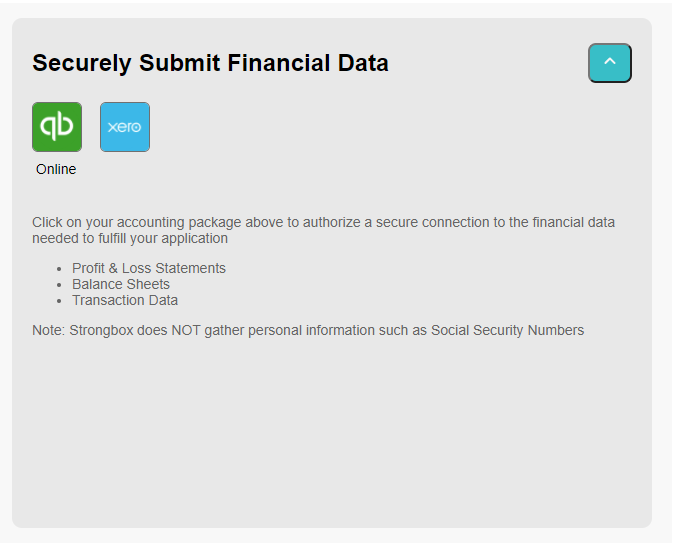

# Strongbox SDKS

Get familiar with the REST API by reading the [Developer Guide](https://developer.strongbox.link/guides.html).

Get started by signing up for a developer account at [https://developer.strongbox.link](https://developer.strongbox.link).

## Interact with the APIs:

### Swagger UI

Check out the Swagger UI page for the [Strongbox Financial Suite](https://developer.strongbox.link/api-details#api=strongbox-financial-suite).

### Postman

Postman scripts are coming soon.

## Develop your integration:

### .NET SDK

Our .NET SDK libraries are coming soon.

### NodeJS SDK

Our NodeJS components are coming soon.

## Web Widgets

Drop one of our web browser widgets into your website to get going quickly.

The **FinConnector Web Widget** allows your customer to connect their accounting system and to import their financials

